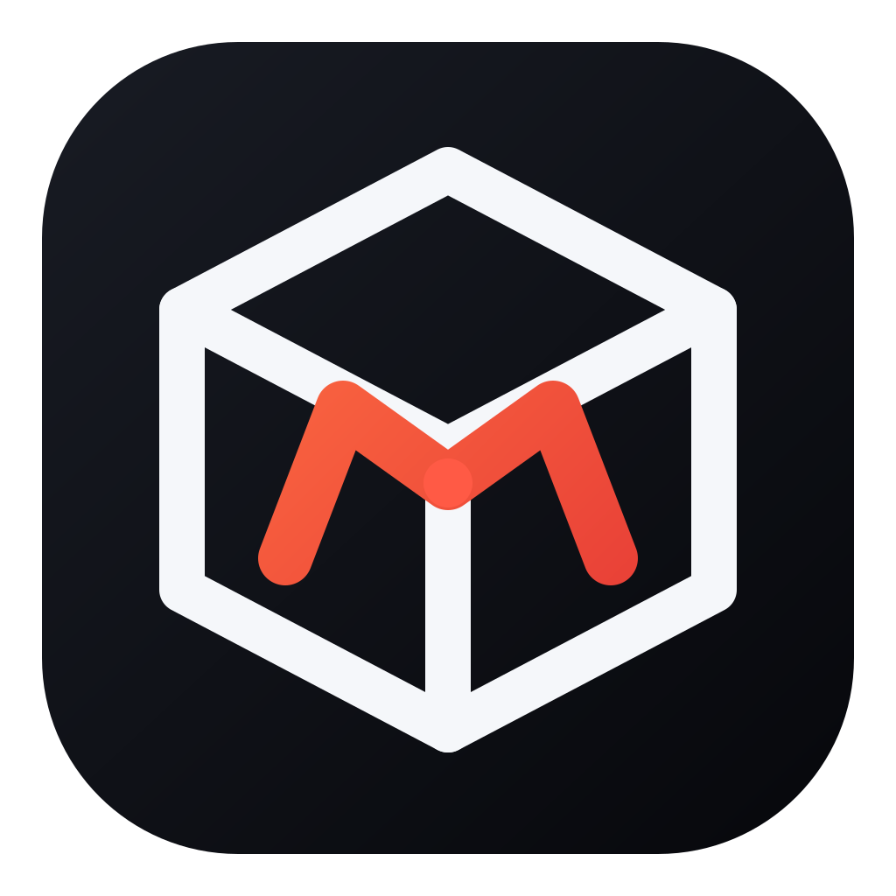

<p align="center">
  
</p>

<h1 align="center">mvn.sh CLI</h1>

The official command-line client for [mvn.sh](https://mvn.sh). It installs an authenticated mvn.sh repository profile in Maven's `settings.xml`.

## Install

### Installer (Linux and macOS)

```bash
curl -fsSL https://github.com/mvn-sh/cli/raw/refs/heads/main/install.sh | sh
```

The installer verifies the release checksum and places `mvnsh` in `~/.local/bin`. Set `MVNSH_INSTALL_DIR` to choose another directory.

### Windows

Download the MSI package from [GitHub Releases](https://github.com/mvn-sh/cli/releases), or install from PowerShell:

```powershell
irm https://github.com/mvn-sh/cli/raw/refs/heads/main/install.ps1 | iex
```

Both Windows installers add `mvnsh` to your `PATH`.

### Go

```bash
go install github.com/mvn-sh/cli/cmd/mvnsh@latest
```

### Release archive

Download the archive for your platform from [GitHub Releases](https://github.com/mvn-sh/cli/releases), then place the `mvnsh` binary on your `PATH`.

## Usage

```bash
mvnsh login
```

The CLI opens mvn.sh in your browser. Sign in, choose a team and repository, and approve the scoped credential. The CLI then updates `~/.m2/settings.xml` with:

- a Maven server containing the token credentials;
- a repository and plugin repository profile;
- an active-profile entry.

Existing Maven configuration is retained. Each repository gets a distinct server and profile ID (for example, `mvn-sh-acme-releases` and `mvn-sh-acme-snapshots`), so logging into one repository does not overwrite another repository's credentials. Managed entries are marked with `mvnsh:` comments and only the matching repository entry is replaced on subsequent logins. The original file is copied to `~/.m2/settings.xml.bak`, and the resulting settings file is restricted to the current user.

For automation, provide an existing scoped token:

```bash
MVN_TOKEN='mvn_…' mvnsh login --team acme --repository releases
```

Run `mvnsh login -h` for all options, including custom Maven settings and profile paths.

Add the repository to the Maven `pom.xml`, Gradle `build.gradle`, or Gradle Kotlin DSL `build.gradle.kts` in the current project:

```bash
mvnsh configure
```

The command interactively opens mvn.sh to select a team and repository when they are omitted. It configures both dependency resolution and distribution/publishing, follows each build tool's syntax, preserves existing repositories, and is safe to run repeatedly. Maven resolves credentials from the server installed by `mvnsh login` (the repository IDs match by default). Gradle reads its publishing password from `MVN_TOKEN`, keeping credentials out of source control. For automation, pass `--team` and `--repository`. Use `--project` for another directory, `--type` to select a build tool explicitly, or `--id` to override the repository ID.

Update an installed release at any time:

```bash
mvnsh update
```

## Local development

```bash
go test ./...
go build -o bin/mvnsh ./cmd/mvnsh
```

To use a local mvn.sh stack:

```bash
./bin/mvnsh login \
  --app-url 'http://localhost:3000' \
  --api-url 'http://localhost:8080' \
  --base-url 'http://%s.localhost:8080'
```

## License

[Apache License 2.0](LICENSE)
